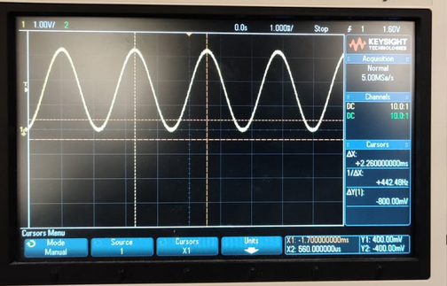
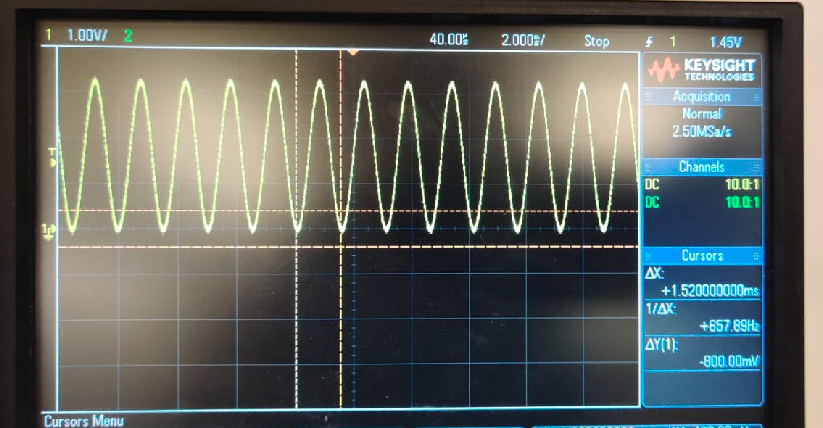
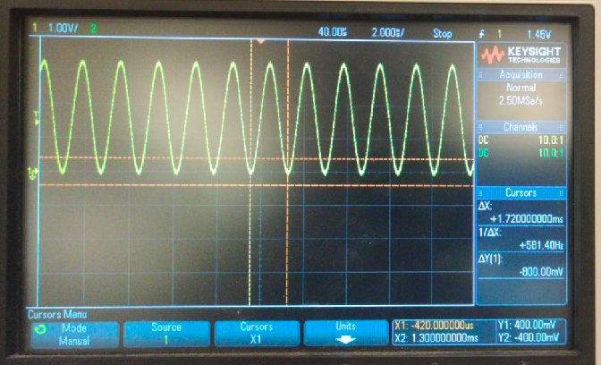
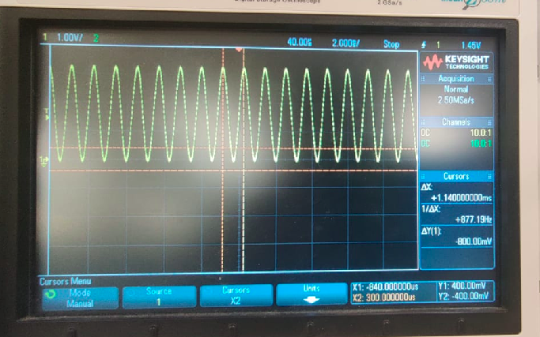

# PES-Assignment-7
Author: Arpit Savarkar

## Repository Comments 
_Contains_
Code for Assignment 7 for Principals of Embedded Systems Software, ECEN-5813, Fall 2020
Only DEBUG Target is considered for this assignment whose goal is mathematically generate four pure tones in the form of analog signals memory access (DMA) subsystem.

contact arpit.savarkar@colorado.edu

### Repository for PES-Assignment 7

Source Code for this assignment can be found under source/

- <b>main.c - The main script which initializes the mathematically generate four pure tones in the form of analog signals. </b>
- <b>ADC.h - Header file of ADC.c the buffer functionalities and #defines for ADC</b>
- <b>ADC.c - This module will contain the necessary configuration and runtime code
to capture a number of input samples at the capture sampling frequency specified above.</b>
- <b>DAC.h - Header file of DAC.c buffer functionalities and #defines for DAC </b>
- <b>DAC.c - This module will contain the necessary configuration and runtime
code that allows you to pass your computed buffer of audio samples into the module. The
module will use the KL25Z’s DAC, TPM0, and DMA hardware to repeatedly play out the buffer
without further intervention from your main loop. </b>
- <b>fp_sine.h - Header file for fp_sine.c Initializes the Lookup Table </b>
- <b>fp_sine.c - Loopup Table setup and Integer Based Sine Function calculator  </b>
- <b>util.h - Header file for util.c setting up the Handles the </b>
- <b>util.c - computes the samples representing a pure tone of a specified frequency, based on your sin(x) function. </b>

## Project Comments
This projects implements the following routine :  

Intially the test harness showcases the number of test cases passed  

- A function to accurately compute sin(x) using only integer math. You may do this using either a lookup table or a hybrid Taylor series approach, as long as you meet the requirements below.
- A tone_to_samples() function, which computes the samples representing a pure tone of a specified frequency, based on your sin(x) function. Use this function to fill a buffer of output samples.
- An audio output module. This module will contain the necessary configuration and runtime code that allows you to pass your computed buffer of audio samples into the module. The module will use the KL25Z’s DAC, TPM0, and DMA hardware to repeatedly play out the buffer without further intervention from your main loop.
- An audio input module. This module will contain the necessary configuration and runtime code to capture a number of input samples at the capture sampling frequency specified above.
- An audio analysis module. After capture, your code should analyze the captured buffer, reporting the minimum, maximum, and mean values. You should also integrate my autocorrelation function, provided on Canvas, to recover the fundamental period represented in the sampled audio.

## Installation/Execution Notes
Developed using MCUExpresso on Linux.  
    DEBUG Target - Prints DEBUG Messages to UART terminal.  

## Images of the OUTPUT on terminal 

- 440 Hz  

- 587 Hz  

- 659 Hz  

- 880 Hz  

## Extra Credit 
- Ossiloscope Images Attached with Wrap Functionality Corrected for